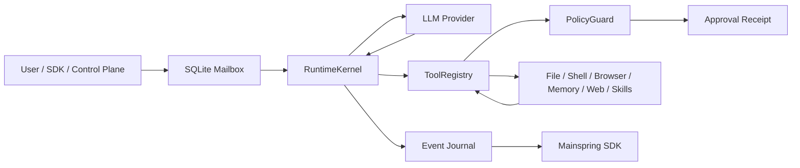

# Architecture

Mainspring is a single TypeScript package that turns model output into a controlled agentic runtime loop.

## Core Boundary



The LLM never executes tools directly. It emits provider events. The runtime validates and routes those events through policy, approvals, tool execution, sanitization, and event persistence.

## Runtime Components

| Component | Files | Role |
| --- | --- | --- |
| Runtime kernel | `src/runner/RuntimeKernel.ts` | Polls inbound messages, formats prompts, starts provider queries, handles tool calls, writes events, completes runs. |
| Mailbox | `src/mailbox/*` | Durable SQLite transport for inbound messages, outbound messages, events, attachments, heartbeats, and processing acks. |
| Provider layer | `src/providers/*` | Provider abstraction plus OpenRouter/OpenAI-compatible HTTP clients, registry, mock, and echo providers. |
| Tool registry | `src/tools/ToolRegistry.ts` | Exposes tool manifests, checks policy, validates approval receipts, executes tools, emits tool events. |
| Policy | `src/policy/*` | Risk decisions, approval requests, receipts, replay protection, and policy defaults. |
| Protocol | `src/protocol/*` | Runtime schemas, mailbox rows, dispatch contracts, event schemas, redaction, path containment helpers. |
| Control channel | `src/control/*`, `src/runner/ChannelBridge.ts` | Optional outbound websocket channel for control-plane turn dispatch and event ACK replay. |
| SDK | `src/sdk/*`, `src/storage/*` | Embedded local facade for sessions, runs, approvals, monitoring, and SQLite-backed storage. |

## Full Turn

```text
session.runs.start
-> command store writes GatewayRunDispatch into the mailbox
-> supervisor discovers the session mailbox
-> RuntimeKernel reads pending inbound row
-> provider receives prompt, system prompt, tools, and model config
-> provider emits text/tool events
-> ToolRegistry validates tool request
-> PolicyGuard allows, denies, or requests approval
-> approval receipt gates dangerous execution
-> tool runs inside workspace boundary
-> output is sanitized and pushed back to provider
-> RuntimeKernel writes normalized events
-> SDK/control plane streams run trace
```

## Storage

The package is local-first:

- Inbound mailbox: SQLite.
- Outbound mailbox: SQLite.
- Event journal: SQLite.
- Attachments/artifacts: filesystem rooted under configured runtime paths.
- SDK session metadata: JSON file beside each mailbox.

Hosted products can wrap the package with Postgres queues, object storage, and container/microVM sandbox drivers without changing the kernel contract.

## Extension Boundary

The embedded package boundary is intentionally small. Applications should import `createMainspring`, `Mainspring`, `MAINSPRING_RUNTIME_IDENTITY`, `RuntimeKernel`, `ToolRegistry`, and the public protocol/control contracts. Product-specific auth, billing, customer records, and hosted queueing should live in a surrounding control plane while Mainspring remains the runtime plane.
